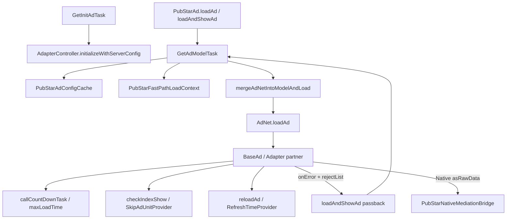

# PubStar Android SDK - Architecture Rules & Context for AI Review

Tài liệu này mô tả **cấu trúc module**, **quy tắc kiến trúc**, và **ràng buộc khi refactor** cho dự án PubStar Android SDK (Kotlin/Java).

Mục tiêu:
- Giúp AI/Developer hiểu rõ **đâu là Public API**, **đâu là core internal**, **đâu là adapter/integration**.
- Giảm rủi ro **breaking change**, **cross-dependency**, và **rò rỉ implementation** ra bề mặt public.
- Hỗ trợ mở rộng thêm network adapter mới theo chuẩn sẵn có.

> Ngữ cảnh build/publish: dự án publish AAR lên Maven (Central và Snapshots). Version & groupId được điều khiển bởi biến môi trường (`ENV_TYPE`, `PUBLISH_TO_MAVEN_CENTRAL`, `VERSION`) và `local.properties`.

---

## 1. Tổng quan cấu trúc (Multi-module Gradle)

Các module chính (theo `settings.gradle.kts`):
- **`:Pubstar`**: Core SDK (AAR) – domain logic, mediation orchestration, models, services, internal bridge.
- **`:PubStar*Adapter`**: Adapter mạng quảng cáo bên thứ 3 (AdMob, AppLovin, Facebook, Pangle, …).
- **`:lib-ads`**: Library phụ trợ (assets/layout/helpers) — tuân boundary như core internal nếu được dùng nội bộ.
- **`:app`**: Sample/Test app — **không** publish, **không** chứa logic SDK.

### 1.1. Publish & dependency (nguồn chuẩn cho ranh giới module)

- **Core**: `io.pubstar.mobile:ads:<version>` (groupId có thể prefix `qa-` / `stage-`).
- **Adapter**: ví dụ `io.pubstar.mediation.adapter.admob:ads`, `io.pubstar.facebook.adapter:ads`, …
- **Adapter → Core**: `implementation(project(":Pubstar"))` khi `pubstarFromProject=true`, hoặc Maven `implementation("<pubstarGroupId>:ads:<version>")`.

**Ràng buộc phụ thuộc (áp dụng mọi module):**
- Adapter → Core: **OK** | Core → Adapter publish: **KHÔNG** | Adapter A → Adapter B: **KHÔNG**

---

## 2. Phân tầng kiến trúc (Layered Architecture)

1. **Public API** — app / mediation adapter publish gọi trực tiếp; ổn định signature.
2. **Core Domain** — orchestration, waterfall, cache, timeout, frequency, tracking.
3. **Infrastructure / Adapters** — SDK bên thứ 3; callback về Core qua contract.

**Nguyên tắc phụ thuộc:** Public API chỉ đi xuống Core (không chứa logic nghiệp vụ nặng). Core không hard-code từng adapter publish. Adapter giao tiếp Core qua **interface/contract**.

---

## 3. Ranh giới truy cập & Public API

### 3.1. Public API (BẮT BUỘC ổn định)

Bao gồm: class/interface app import trực tiếp; listener/callback; config khi init/load/show.

- Không đổi package/class/signature public trừ khi có breaking change có chủ đích.
- Không leak type internal trong signature public.
- Thêm API mới: ưu tiên overload / builder; deprecate thay vì sửa cũ (binary compatibility).

### 3.2. Core internal

- Kotlin: mặc định `internal`. Java: ưu tiên package-private.
- Không `public` hoá class internal để gọi chéo — dùng interface/entrypoint ở Core.

### 3.3. `PubStarAdController` — chỉ cho bên ngoài `:Pubstar`

Facade: `PubStarAdManager.getAdController()` / `PubStarAd.getAdController()`.

| Được gọi | Không gọi (trong `:Pubstar`) |
|----------|------------------------------|
| Host app | `io.pubstar.mobile.core.*` (trừ `PubStarAd` implement facade) |
| Module publish (`PubStarAdmobAdapter`, `PubStarApplovinAdapter`, …) | `adapter.*`, `base.*`, `utils`, `tasks`, `mediation.internal.*` (không thêm gọi controller) |

**Cấm từ nội bộ:** `load`, `show`, `loadAndShow`, `isReady` trên controller (kể cả qua `PubStarAdManager`).

**Luồng nội bộ bắt buộc:** xem sơ đồ **§12.1** (`loadAd` → `GetAdModelTask` → `AdNet` → `BaseAd` → partner). Không quay ngược `getAdController()`.

**Cấm cầu nối không chính thức:** `*Helper`/`*Bridge`/extension wrap controller; cast sang `PubStarAdControllerHelper`; adapter nhúng trong core gọi `loadAndShow` thay vì `AdNet` → `BaseAd`. Mediation native: mở rộng `NativeAdRequest` / `PubStarNativeMediationBridge` SPI — không thêm wrapper controller.

**Ngoại lệ duy nhất (technical debt):** `PubStarNativeMediationBridge.loadNative` gọi `getAdController().loadAndShow` — không nhân bản; refactor sang entry `loadAd` nội bộ.

**PR grep** trong `Pubstar/src` (trừ `PubStarAd.kt` + file ngoại lệ): `getAdController().load|show|loadAndShow`, `PubStarAdManager.getAdController()`.

---

## 4. Quy tắc module boundary

### 4.1. Core (`:Pubstar`)

Orchestration + chuẩn hoá callback. **Không import SDK quảng cáo bên thứ 3** (trừ case đã duyệt). Logic từng network nằm adapter tương ứng.

### 4.2. Adapters (`:PubStar*Adapter`)

Bao SDK network; map error → Core. Tuân **§1.1** dependency. Waterfall/passback/refresh: **§12** (Core) — adapter không tự implement policy. `compileOnly` third-party khi phù hợp publish.

### 4.3. Sample (`:app`)

Chỉ demo/test; không đưa logic SDK vào app rồi copy ngược.

---

## 5. Package / naming

- Core: `io.pubstar.mobile.*` | Adapter publish: namespace riêng (`io.pubstar.mediation.adapter.*`, …).
- Tên class theo format/network; listener domain đặt ở Core.

---

## 6. Threading, lifecycle, memory

- Không giữ `Activity`/`View` lâu hơn lifecycle; ưu tiên `applicationContext`.
- Callback UI về main thread; không block main bằng network/disk.
- Cancel `Handler`/coroutine/timer timeout khi destroy.
- Load/show: state machine rõ, tránh double-callback.

---

## 7. Error & logging

- Public API: không throw trừ misuse có message rõ.
- Adapter map lỗi network → error code Core.
- Log theo `isShowLog`/`isDebug`; **không log** PII/credentials/token/GAID.

---

## 8. Config, môi trường, git hygiene

- URL/endpoint: `BuildConfig` / `local.properties` — không hardcode production.
- Không credential trong source.
- Không commit `*/build/`, generated `BuildConfig.java`, `R.jar`, `R.txt`, …

---

## 9. Resources & UI

- Resource id ổn định (Proguard/shrinker). UI chỉ render — không đưa logic mediation vào layout class.

---

## 10. Proguard / R8

- Reflection / SDK third-party: keep rule trong `consumer-rules.pro` (ưu tiên) hoặc `proguard-rules.pro` đúng module. Không xoá rule đang cần.

---

## 11. Refactor — checklist tham chiếu

| Chủ đề | Chi tiết |
|--------|----------|
| Public API & binary compat | §3.1 |
| Visibility / internal | §3.2 |
| Không gọi controller nội bộ | §3.3 |
| Module & dependency | §1.1, §4 |
| Config / secrets / build output | §8 |
| Partner & CRITICAL code | §12, §13 |
| Review PR | §14 |

---

## 12. Luồng vận hành Partner (Protected Operational Flows)

**Xương sống mediation** — đọc kỹ trước khi sửa. Chi tiết symbol CRITICAL: **§13.1**.

### 12.1. Sơ đồ luồng tổng quan

### 12.2. Init — `GetInitAdTask`

| Thành phần | Ràng buộc |
|------------|-----------|
| `GetInitAdTask` | Cache SP `TAG_INIT_CACHE`; giữ fallback khi network fail |
| `InitializeAdapterService` | Không load/show khi `!isSuccess` |
| `AdapterController.initializeWithServerConfig` | Sau init success; không hardcode ORT URL/publisher |

### 12.3. Per ad unit / waterfall — `GetAdModelTask`

| Thành phần | Ràng buộc |
|------------|-----------|
| `GetAdModelTask` | Timeout 20s trừ khi product đổi |
| `createURLGetAd` + `skipConfigs` | `rejectList` ↔ passback — đồng bộ server |
| `onGetAdModelSuccess` | `configId` / `configTimeUpdateKey` / `order`; giữ `activeAdLoadSessionByUnit` |
| `PubStarAdConfigCache` | Key `adUnitId \| skipConfigs` |
| `PubStarFastPathLoadContext` | Không deliver sau `abortFastPath` / session hết hạn |

**Waterfall:** `rejectList` = `configId` đã fail → `loadAndShowAd` passback; `callReject` = terminal `NO_AD` (clear reject). `mergeAdNetIntoModelAndLoad`: không reorder `adNets` tùy tiện.

**Semantique `AdNet`:** `timeDelay == -1` → tắt refresh | `timeOut`/`maxShow <= 0` → bỏ cap | `maxLoadTime` → load timeout | `configId` → identity waterfall | `isChangeRefresh` → `CHANGE_FREQUENCY`.

### 12.4. Refresh

`reloadAd` + `TimeOutProvider` (theo `configId`); `reloadAd(View)` + `RefreshTimeProvider` + lifecycle. Native raw: giữ `deliverRawNativeDataIfRequested` → `reloadAd` + `registerRawMediationRefreshScheduler`.

### 12.5. Timeout & frequency

`callCountDownTask` cancel trong `destroy`; `SkipAdUnitProvider` vs `SkipConfigProvider`; `callWhenError`: **raw `asRawData`** không thêm `configId` vào reject.

### 12.6. Mediation bridge (AdMob / MAX native)

`PubStarNativeMediationBridge` — `@RestrictTo(LIBRARY_GROUP)`. `loadAdNetForMerge`: giữ `adLoaderListener` khi `asRawData`. Adapter publish: chỉ map asset/tracker — policy **§12.3–12.5**.

### 12.7. Session (`PubStarAd`)

`listKey` synchronized; `activeAdLoadSessionByUnit` bỏ response cũ; `scopeMain` / `scopeBackground`.

---

## 13. Change Control (side effect cao)

**CRITICAL:** mô tả PR + test **§13.2** + review người hiểu mediation.

### 13.1. CRITICAL symbols

| Symbol | Rủi ro chính |
|--------|----------------|
| `PubStarAd.loadAd` / `loadAndShowAd` / `onGetAdModelSuccess` / `mergeAdNetIntoModelAndLoad` / `loadAdNetForMerge` / `callReject` | Session, waterfall, passback |
| `GetAdModelTask` / `GetInitAdTask` | Sai partner / không init |
| `BaseAdTimeOutAndMaxShow.reloadAd` / `deliverRawNativeDataIfRequested` / `callWhenError` | Refresh storm / mediation break |
| `PubStarNativeMediationBridge.loadNative` | Double load / refresh |
| `PubStarAdConfigCache` / `PubStarFastPathLoadContext` | Stale config / double callback |
| `TimeOutProvider` / `RefreshTimeProvider` / `Skip*Provider` | Timer leak / frequency |
| `AdNet.loadAd` / `handleLoadAd` | Sai network SDK |

### 13.2. HIGH (sửa được, phải test hành vi)

`PubStarAdController.show`, `tryLoadSingleFromCachedAd`, `AdNet` timing fields, `AdapterController`, `InitializeAdapterService`, `Utils.convertToSkipConfigs`.

### 13.3. Quy tắc bổ sung khi sửa CRITICAL

- Tuân **§3.3** (controller) và **§12** (semantique magic values).
- Không gộp `loadAd` + `onGetAdModelSuccess` thành một hàm.
- Không xoá `synchronized` / `sessionId` / `WeakReference` refresh scheduler không có thay thế.
- Lỗi mới: chọn **passback** (`rejectList`) hay **terminal** (`callReject` / `NO_AD`).
- `GetAdModelTask` URL: phối hợp backend.

### 13.4. Test tối thiểu (partner flows)

- [ ] Init cold (có/không cache)
- [ ] Load 1 partner OK
- [ ] Fail A → passback B (`skipConfigs` trên URL)
- [ ] Refresh (`timeDelay > 0`) / `timeDelay = -1` không refresh
- [ ] Frequency vượt cap → skip / `REJECT_BY_FREQUENCY`
- [ ] AdMob/MAX native: load → display → refresh → terminal re-arm
- [ ] `GetAdModelTask` mất mạng: fast path hoặc `NO_AD`

---

## 14. Checklist PR / Review

- [ ] Public API / breaking change? (§3.1)
- [ ] Module boundary & dependency? (§1.1, §4)
- [ ] Gọi controller / bridge nội bộ? (§3.3 — grep)
- [ ] Đụng partner flows / CRITICAL? (§12, §13 — nếu có: §13.4)
- [ ] Thread/lifecycle leak? (§6)
- [ ] Dependency transitive / Proguard? (§10)
- [ ] Build output / secrets / PII log? (§8, §7)
